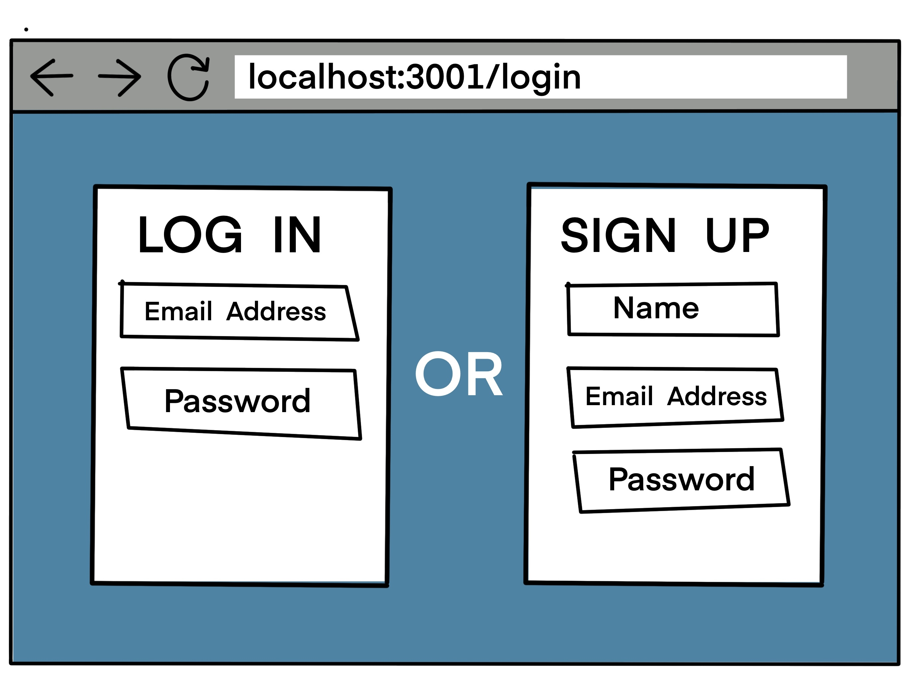
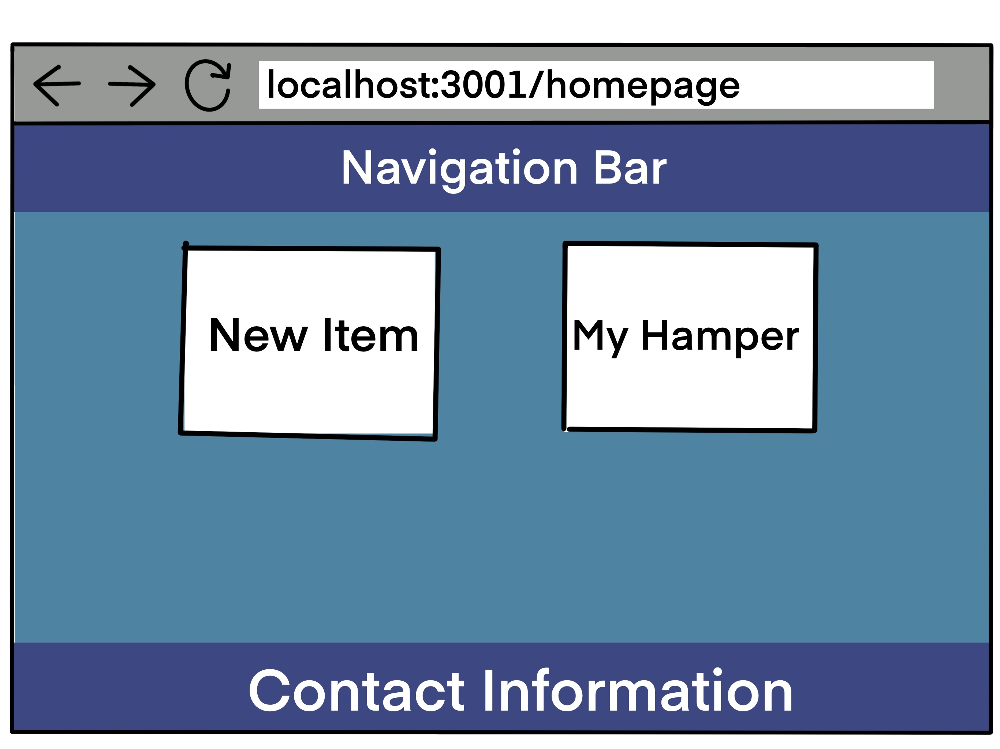
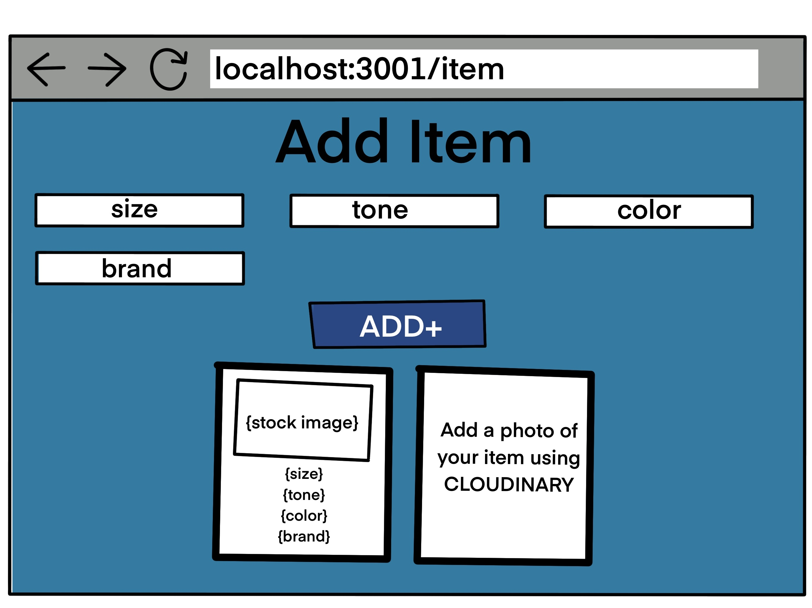
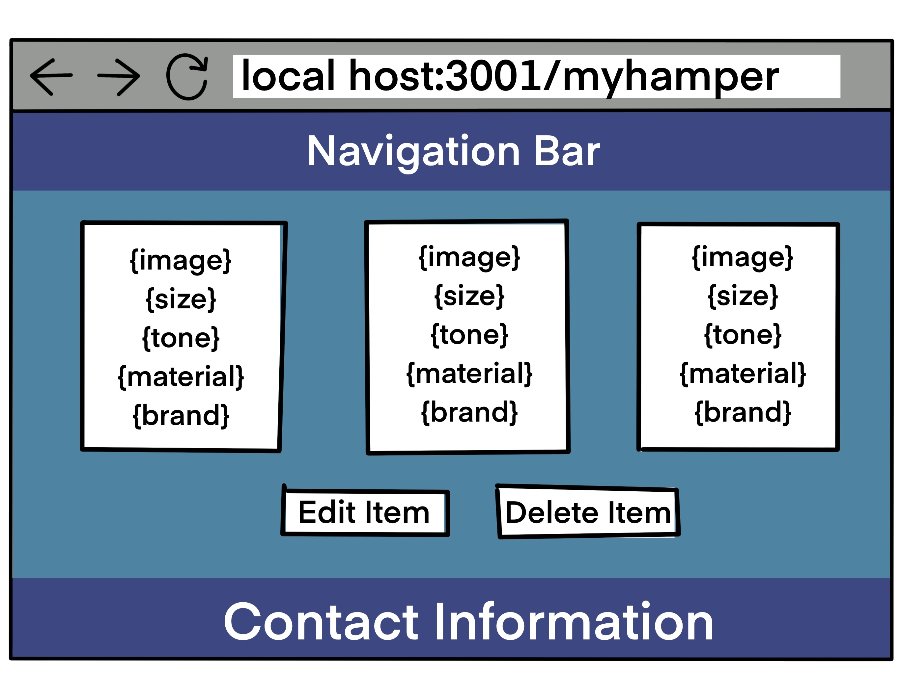

# Hamper

## Badges

## Description
Hamper is an application that is designed to be used for a laundry/dry cleaning company. Through this app, the company's customers can have a more personalized and convenient experience. The application acts as a middle man for company and customer by allowing the user to create an account, add items to their "hamper", customize or delete items in their hamper, and update settings like if they want their cleaned clothes delivered or pick them up. They can also set their email preferences to recieve notifications when their order is ready or being delivered along with discounts and current promotions.
## Table of Contents
- [Installation](#installation)
- [Usage](#usage) 
- [Credits](#credits)
- [License](#license)
- [Contribution](#contribution)
## Installation
`git clone git@github.com:Shalah/hamper.git`
## Usage
The first page the user will see upon launching the app site is the login/create account page. This is because the user must create an account or login with an existing account in order to use the application.

Once the user has created an account or logged in they will be redirected to the home page. From here they can change their account settings, add an item to their hamper, or view their hamper.

From the homepage, if you select "New Item", you'll be taken to the item page. Here, you can add a new item that will then appear in your hamper.

From the homepage, if you select "My Hamper", you'll be taken to the my hamper page. Here, you can view all of the items that you have added and delete existing items.

## Credits
 - Front-End Development: https://github.com/ChaseKY
 - Back-End Development: https://github.com/Shalah
 - Image Designer & Front End Development: https://github.com/bryanorbe

## License

## Contribution
Contact us for any contribution.

[Contributor Covenant](https://www.contributor-covenant.org/)